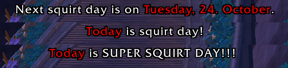
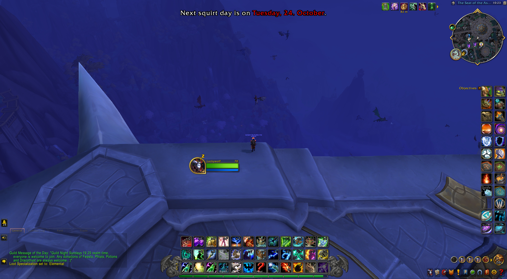

# Battle Pet Utilities

This addon aims to provide a few useful utilities for any WoW battle pet enthusiast. Its origins are in two different WeakAuras I made back in Shadowlands, that have stopped working.

## Features

Currently the only implemented feature is the squirt day helper. It will remind you of the next squirt day in any of a few select zones (only major cities and non-combat zones, like Valdrakken or Oribos). Also during squirt days you will be reminded to use your [Safari Hat](https://www.wowhead.com/item=92738/safari-hat) and ([Lesser](https://www.wowhead.com/item=98112/lesser-pet-treat)) [Pet Treats](https://www.wowhead.com/item=98114/pet-treat).

Here is a screenshot of the different messages from the Squirt Day Helper:

And here is a screenshot of a vanilla UI with the Squirt Day reminder showing:

## Installation

This addon is officially available from [its Wago Addons page](https://addons.wago.io/addons/battlepetutilities), as well as through [GitHub releases](https://github.com/JP1998/BattlePetUtilities/releases). Furthermore you can download the source code directly from [the GitHub repository](https://github.com/JP1998/BattlePetUtilities).

I've chosen these platforms because they are the ones I personally use, and at this time I don't see a reason to create releases for other platforms, as there is no demand. Nonetheless, I understand some people also use WowInterface or CurseForge, so if you'd like me to create releases on any other addon platform please [create an issue on GitHub](https://github.com/JP1998/BattlePetUtilities/issues/new) and I'll look into it.

## Planned features and improvements

The following features and improvements are planned:

 - A battle pet item mailer, which sends any battle pet related items to a specific character on your realm once you open the mailbox.
    - You will be able to select a character to send these items to **per realm**. (I'm not quite sure yet on how to treat connected realms)
    - You will be able to configure exactly which items you want to mail to the selected character.
 - A world and repeatable quest tracker, which shows you which world or repeatable battle pet related quests you can currently do at the moment on the selected character.
    - This tracker is supposed to be filtered by quest reward.
 - Performance improvements to the squirt day helper when the player is not in any of the selected zones. The updating it does in the current state may not have much of an impact, however they are still uselessly executed even while the reminder is not shown.

## Contribute

You are very welcome to contribute to this repository by cloning it and once you've made changes opening a pull request. I'll take a look at those changes as soon as I am able to.
